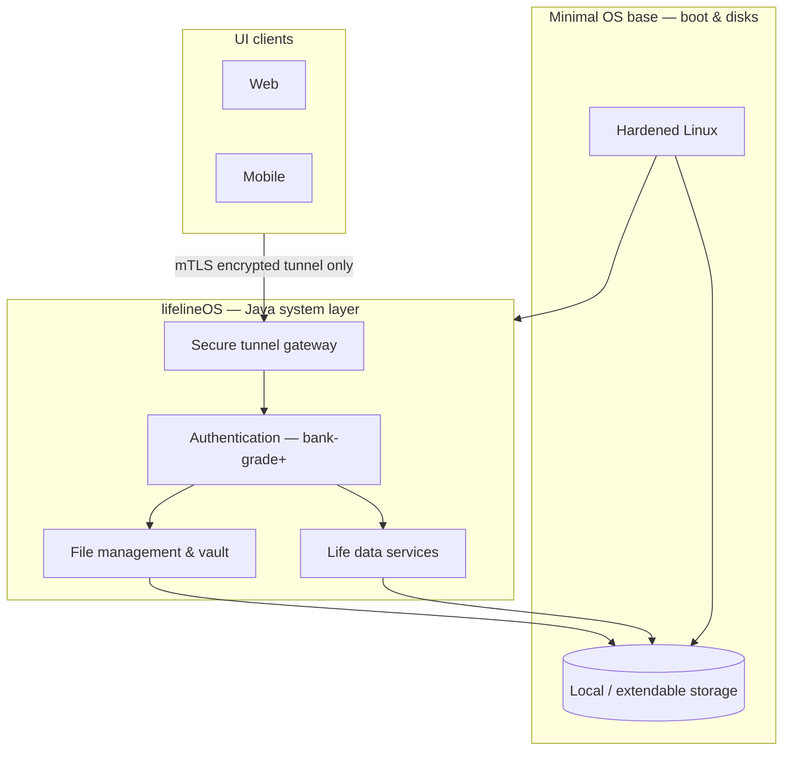

# lifelineOS

**lifelineOS** is a dedicated **operating system** for one person — not a mobile app or a cloud SaaS product. It is a secure system that runs on hardware you own, manages your private life data locally, and exposes only **authenticated, encrypted tunnels** to UIs and remote clients.

## What it is

An OS for an individual that:

- Keeps a **complete private record** of life (health, fitness, finance, and more)
- Stores everything on **your device** (later: dedicated lifeline hardware with **extendable storage**)
- Provides **basic file management** under strict security — browse, organize, encrypt, and back up your vault; no raw storage exposed on the network
- Connects UI and hardware only through **secure tunnels** with authentication **stricter than typical banking apps** (mTLS, TLS 1.3+, encryption at rest, hardware-bound identity where available)
- Supports **remote access** only through those tunnels — never by shipping data to a shared cloud
- Grows into **insights and suggestions** from your own history (health, fitness, finance, etc.)

## Can we build an OS with Java?

**Yes — for the system we are building, Java is the right primary language**, with one important distinction:

| Layer | Language / approach | Role |
|-------|---------------------|------|
| **Boot & hardware** | Minimal hardened **Linux** (dev: your PC; product: **Raspberry Pi** / appliance) | Drivers, disk, network, boot |
| **lifelineOS (the product)** | **Java 21** — implemented in [`lifeline_Java`](lifeline_Java/) | OS core: file management, tunnels, authentication, vault, life-data services |
| **UI** | Separate clients (web / **mobile** / shell) | Talk to the OS **only** through the secure tunnel |

We are **not** building a general-purpose desktop OS kernel from scratch in Java (historical projects like JavaOS/JNode are not a practical path for a secure product). We **are** building **lifelineOS as a Java-first system platform**: the OS behavior users and integrators see — files, security, identity, storage, APIs — is implemented and extended in Java. That is the same model many secure appliances use: small trusted base + Java system services.

So: **lifelineOS is an OS; `lifeline_Java` is how we develop it in Java.**

## Repository layout

| Path | Purpose |
|------|---------|
| [`lifeline_Java/`](lifeline_Java/) | **OS core in Java** — tunnels, mTLS, MFA, vault, files, backup, storage volumes |
| [`lifeline_UI/`](lifeline_UI/) | **UI clients** (tunnel-only; outside the Java tree — no direct disk access) |
| [`GUIDE.md`](GUIDE.md) | **Complete how-to**: modes, security stack, run instructions, project flow |
| [`STRUCTURE.md`](STRUCTURE.md) | Detailed folder map and storage layouts |
| *(future)* `lifeline_image/` | Bootable OS image: minimal Linux + lifeline Java core as system service |

## Architecture (high level)



**Principles**

- **Single owner** — one person, one device (or trusted pairings); no multi-tenant cloud.
- **Local-first** — disk on your machine or appliance is the source of truth.
- **Tunnel-only access** — UI never opens the database or filesystem directly.
- **Java evolves the OS** — new capabilities ship as versioned system services in `lifeline_Java`.

## Workstation → Raspberry Pi product

| Phase | Environment | Storage | Access |
|-------|-------------|---------|--------|
| **Lab (PC)** | Your computer running `lifeline_Java` | Home disk or **D:** card (`card` profile) | Local web UI; HTTP only for development |
| **Device** | **Raspberry Pi** (or similar) + Linux | Onboard / **attached memory card**; extendable volumes | Phone installs/opens UI; **HTTPS + mTLS + MFA only** |
| **Image** | Bootable lifelineOS image | Encrypted volumes managed by the device | Same Java core as systemd service at boot |

The security model does **not** change between PC lab and Pi: only the host OS and paths change. See [`GUIDE.md`](GUIDE.md) §8b for the Pi + phone architecture and why decrypted gallery bytes must ride inside TLS.

## Getting started

Read **[`GUIDE.md`](GUIDE.md)** for a complete explanation of **developer / local / bank-level / production** modes, MFA, mTLS, storage locations, and end-to-end flows.

The runnable OS core lives in [`lifeline_Java/`](lifeline_Java/). Folder map: [`STRUCTURE.md`](STRUCTURE.md). UI: [`lifeline_UI/`](lifeline_UI/).

### Prerequisites

- **Java 21** (JDK) installed and available on your `PATH`
- No separate Maven install needed — the project includes the Maven Wrapper (`mvnw` / `mvnw.cmd`)

Verify Java:

```bash
java -version
```

You should see a version that starts with `21`.

### Run the OS core

From the repository root:

**Windows (PowerShell or Command Prompt):**

```powershell
cd lifeline_Java
.\mvnw.cmd spring-boot:run
```

**macOS / Linux:**

```bash
cd lifeline_Java
./mvnw spring-boot:run
```

The first run downloads dependencies (may take a few minutes). When startup finishes, the process listens on **port 8080**.

### Verify it is running

Open a browser or use curl:

```text
http://localhost:8080/
```

Expected response: `Lifeline OS Running`

```bash
# Windows PowerShell
Invoke-WebRequest http://localhost:8080/

# macOS / Linux
curl http://localhost:8080/
```

### Build and test

```powershell
# Windows
cd lifeline_Java
.\mvnw.cmd test
.\mvnw.cmd package
```

```bash
# macOS / Linux
cd lifeline_Java
./mvnw test
./mvnw package
```

After `package`, the runnable JAR is under `lifeline_Java/target/`.

### Notes

- There is a separate **UI** in [`lifeline_UI/`](lifeline_UI/) — it only talks to the OS over HTTP(S)/mTLS.
- For the **100GB memory card on D:**, run with Spring profile `card` (see [`STRUCTURE.md`](STRUCTURE.md)).
- Port `8080` is for **local development**; `mtls` / `device` profiles use **8443** with TLS 1.3.

## Roadmap (project)

- [x] Java OS core (`lifeline_Java`)
- [x] Secure tunnel gateway + authentication (Bearer lab + **mTLS device identity**)
- [x] MFA (TOTP) + short-lived session tokens
- [x] Local vault storage + **file management** APIs
- [x] Encrypted backup/export
- [x] Extendable storage volumes (Windows **D:** / Linux mounts)
- [x] Life domains stubs (health, finance, insights)
- [x] Web UI outside Java (`lifeline_UI/`) with vault gallery
- [ ] Default **HTTPS-only** content APIs outside lab profile
- [ ] Mobile client (PWA/native) with cert pinning for Raspberry Pi
- [ ] Raspberry Pi `device` deploy runbook + firewall
- [ ] Hardware-bound / TPM identity where available
- [ ] Bootable lifelineOS image
- [ ] Richer life domains + insights

---

*lifelineOS — your life, your hardware, your system.*
