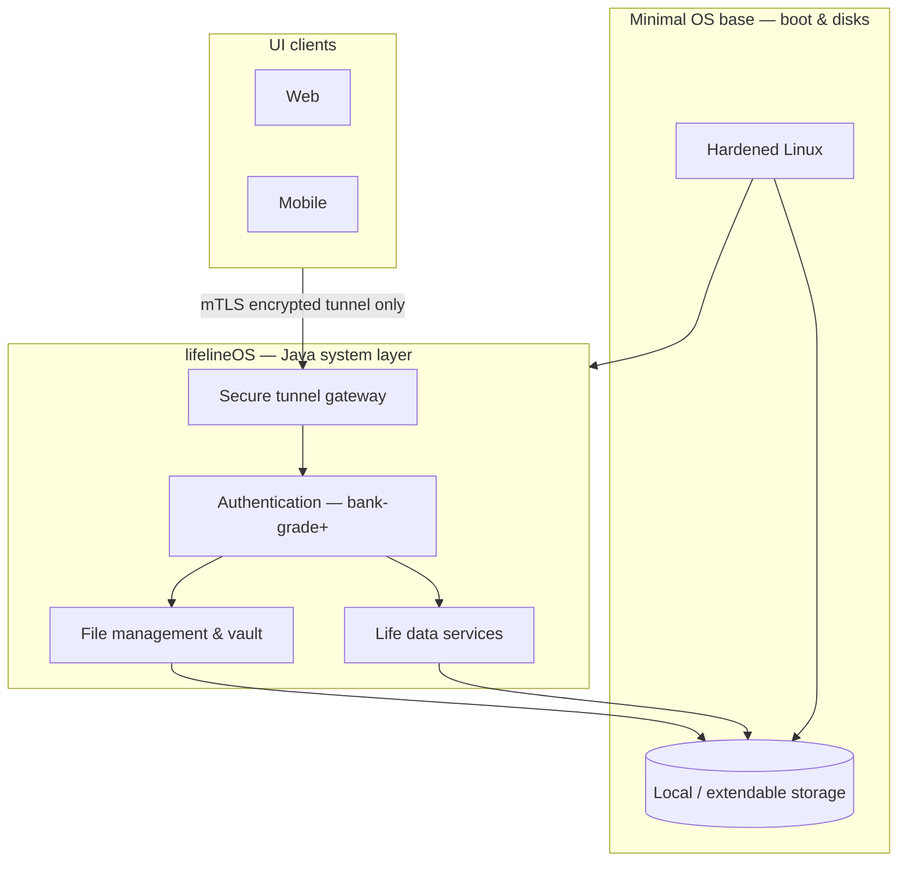

# lifelineOS

**lifelineOS** is a dedicated **operating system** for one person — not a mobile app or a cloud SaaS product. It is a secure system that runs on hardware you own, manages your private life data locally, and exposes only **authenticated, encrypted tunnels** to UIs and remote clients.

## What it is

An OS for an individual that:

- Keeps a **complete private record** of life (health, fitness, finance, and more)
- Stores everything on **your device** (later: dedicated lifeline hardware with **extendable storage**)
- Provides **basic file management** under strict security — browse, organize, encrypt, and back up your vault; no raw storage exposed on the network
- Connects UI and hardware only through **secure tunnels** with authentication **stricter than typical banking apps** (mTLS, TLS 1.3+, encryption at rest, hardware-bound identity where available)
- Supports **remote access** only through those tunnels — never by shipping data to a shared cloud
- Grows into **insights and suggestions** from your own history (health, fitness, finance, etc.)

## Can we build an OS with Java?

**Yes — for the system we are building, Java is the right primary language**, with one important distinction:

| Layer | Language / approach | Role |
|-------|---------------------|------|
| **Boot & hardware** | Minimal hardened **Linux** base (MVP: your PC; later: custom appliance) | Drivers, disk, network, boot |
| **lifelineOS (the product)** | **Java 21** — implemented in [`lifeline_Java`](lifeline_Java/) | OS core: file management, tunnels, authentication, vault, life-data services |
| **UI** | Separate clients (web / mobile / shell) | Talk to the OS **only** through the secure tunnel |

We are **not** building a general-purpose desktop OS kernel from scratch in Java (historical projects like JavaOS/JNode are not a practical path for a secure product). We **are** building **lifelineOS as a Java-first system platform**: the OS behavior users and integrators see — files, security, identity, storage, APIs — is implemented and extended in Java. That is the same model many secure appliances use: small trusted base + Java system services.

So: **lifelineOS is an OS; `lifeline_Java` is how we develop it in Java.**

## Repository layout

| Path | Purpose |
|------|---------|
| [`lifeline_Java/`](lifeline_Java/) | **OS core in Java** — system services, security, local storage, file management APIs (MVP and device) |
| *(future)* `lifeline_UI/` | UI clients (tunnel-only, no direct disk access) |
| *(future)* `lifeline_image/` | Bootable OS image: minimal Linux + lifeline Java core as PID 1 / systemd service |

## Architecture (high level)



**Principles**

- **Single owner** — one person, one device (or trusted pairings); no multi-tenant cloud.
- **Local-first** — disk on your machine or appliance is the source of truth.
- **Tunnel-only access** — UI never opens the database or filesystem directly.
- **Java evolves the OS** — new capabilities ship as versioned system services in `lifeline_Java`.

## MVP → dedicated hardware

| Phase | Environment | Storage | OS delivery |
|-------|-------------|---------|-------------|
| **MVP** | Your **local computer** (Java core process) | Embedded DB + vault files on local disk | Develop the **Java OS core** before custom hardware exists |
| **Product** | **lifelineOS** on dedicated hardware | Internal + **extendable** encrypted volumes | Bootable image; Java core starts with the system |

MVP proves file management, tunnels, and authentication on a PC. The same Java core moves onto the appliance image without rewriting the security model.

## Getting started

OS core development lives in [`lifeline_Java/README.md`](lifeline_Java/README.md) (build, run, roadmap, package layout).

```bash
cd lifeline_Java
./mvnw spring-boot:run    # Windows: .\mvnw.cmd spring-boot:run
```

## Roadmap (project)

- [x] Java OS core bootstrap (`lifeline_Java`)
- [ ] Secure tunnel + authentication (mTLS, Spring Security)
- [ ] Local vault storage + basic **file management** APIs
- [ ] Life domains (health, finance, …)
- [ ] Bootable lifelineOS image on hardware
- [ ] Extendable storage integration
- [ ] UI clients (tunnel-only)

---

*lifelineOS — your life, your hardware, your system.*
