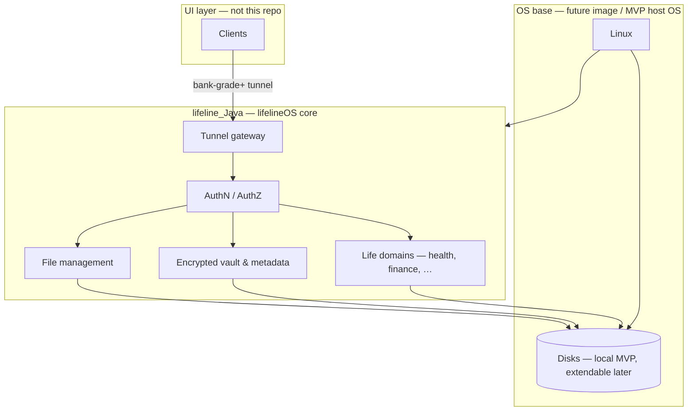

# lifeline_Java — lifelineOS core (Java)

This directory is **not a standalone “backend app.”** It is the **Java implementation of lifelineOS** — the operating system’s core system layer: secure tunnels, authentication, file management, local vault storage, and life-data services.

The [parent README](../README.md) describes the full OS product. **Here is where the OS is developed in Java.**

---

## Java and “building an OS”

**Yes, we implement lifelineOS in Java** — with a clear split that keeps the project achievable and secure:

| What | How |
|------|-----|
| **Kernel / drivers / boot** | Minimal **hardened Linux** (MVP: dev PC; later: appliance image). Handles hardware, block devices, networking at the metal. |
| **lifelineOS (what users experience)** | **Java 21** in this repo — tunnels, auth, file manager logic, encrypted vault, APIs, life domains. |
| **UI** | Separate clients; **only** the secure tunnel, never direct disk or DB access. |

A from-scratch **kernel written entirely in Java** (e.g. old JavaOS-style stacks) is **out of scope** — slow to mature and hard to harden. A **Java-first OS product** — system services that *are* the OS — is standard for secure appliances and matches our goals.

**Mental model:** Linux boots the box; **Java runs lifelineOS.**



---

## What lifelineOS provides (system capabilities)

These are **OS-level services**, not optional app features:

| Capability | Description |
|------------|-------------|
| **Secure tunnels** | All UI ↔ system traffic over encrypted, mutually authenticated channels (TLS 1.3+, **mTLS** target). No plain HTTP in production. Zero trust on LAN. |
| **Authentication** | Identity and session model stricter than typical banking: hardware-bound keys where possible, MFA, short-lived credentials, least privilege. |
| **File management** | Basic operations on the user vault: list, organize, upload/download through the API, quotas, encrypted at rest — **not** exposing SMB/NFS or raw paths to the network. |
| **Local storage** | **MVP:** embedded DB + vault files on the **local computer**. **Later:** OS-managed internal and **extendable** volumes on device. |
| **Life data** | Domains (health, fitness, finance, insights) built on the same vault and security boundary. |

---

## MVP vs lifelineOS on hardware

| Phase | Host | Storage | What you run |
|-------|------|---------|----------------|
| **MVP** | Your PC (Windows / macOS / Linux) | `~/.lifeline/data` (or similar) on **local disk** | `lifeline_Java` process = **OS core in development** |
| **Product** | Dedicated hardware + **lifelineOS image** | Internal + **extendable** encrypted storage | Same Java core as **system service** at boot |

MVP lets you implement tunnels, auth, and file APIs before custom hardware exists. The security and storage contracts stay the same when the core moves onto the appliance.

---

## 1. Secure tunnels (non-negotiable)

Every client (web, mobile, future shell) connects **only** through the tunnel gateway implemented here.

**Target bar (above typical banking)**

- Mutual TLS — client and server prove identity
- TLS 1.3+ only in production
- Encryption at rest for vault and DB files
- Strong authentication (MFA / device keys when available)
- Least-privilege scopes per client
- Local security audit log (no third-party life-data telemetry)
- No anonymous or “open” system APIs on the internet

| MVP | On device |
|-----|-----------|
| HTTPS + Spring Security; localhost / trusted LAN; path to mTLS | Device certificates; optional TPM / secure element |
| Dev trust stores documented | OS-managed tunnel and firewall policy |

---

## 2. File management (OS primitive)

File management is a **first-class OS service**, not a separate utility app.

**Planned responsibilities (`lifelineOS/files` or similar)**

- Vault namespaces (e.g. documents, health exports, backups)
- List / metadata / move / delete through **authenticated APIs only**
- Enforced encryption at rest and per-path permissions
- Integration with extendable storage (mount external volume → vault subtree)
- No direct filesystem paths leaked to UI — opaque IDs and scoped tokens

UI requests files **through the tunnel**; the Java core enforces policy and talks to disk.

---

## 3. Local storage (MVP)

Until hardware images exist, persistence stays on the **developer / user PC**:

| Aspect | MVP |
|--------|-----|
| Metadata / structured data | Embedded SQL (**SQLite** or **H2** file mode) |
| Vault files | Encrypted files under configurable root, e.g. `${user.home}/.lifeline/data` |
| Access | **Only** lifelineOS Java core; UI via tunnel APIs |
| Backup | User-controlled encrypted export |

```properties
# Planned
lifeline.storage.path=${user.home}/.lifeline/data
lifeline.storage.encryption.enabled=true
```

---

## Technology stack (current bootstrap)

| Item | Choice |
|------|--------|
| Language | **Java 21** |
| Framework | **Spring Boot 4** (system service host — Web MVC for tunnel APIs) |
| Build | **Maven** (`mvnw` / `mvnw.cmd`) |
| Tests | JUnit 5 |
| Persistence (next) | Local embedded DB + vault on disk |
| Security (next) | Spring Security, TLS/mTLS |

Artifact: `com.lifeline:lifelineOS` (`0.0.1-SNAPSHOT`).

---

## Internal architecture (Java packages)

```
lifelineOS/
├── security/          # Tunnel termination, mTLS, auth filters
├── tunnel/            # Gateway config, client registry
├── files/             # File management & vault operations
├── persistence/       # Local DB (MVP), future volume adapters
├── config/
├── common/
├── health/
├── fitness/
├── finance/
├── insights/
└── LifelineOsApplication.java   # OS core entry point
```

**Layers:** Security/tunnel → API → Application (use cases) → Domain → Infrastructure (disk, DB, encryption).

Current code: **bootstrap only** (`GET /`, context load test). OS services above are the implementation order on the roadmap.

---

## Project layout

```
lifeline_Java/
├── pom.xml
├── mvnw, mvnw.cmd
├── src/main/java/lifelineOS/
├── src/main/resources/application.properties
├── src/test/java/lifelineOS/
└── README.md
```

---

## Run (MVP development)

```bash
cd lifeline_Java
./mvnw spring-boot:run          # Windows: .\mvnw.cmd spring-boot:run
```

| Endpoint | Notes |
|----------|--------|
| `GET /` | Bootstrap check — `Lifeline OS Running` |
| Default port | `8080` — **dev only**; production requires HTTPS/tunnel |

```bash
./mvnw test
./mvnw package
```

---

## Configuration

```properties
spring.application.name=lifelineOS
```

Planned: storage path, TLS keystores, mTLS trust stores, profiles (`dev` | `device`).

---

## Roadmap

### MVP (Java OS core on PC)

- [ ] Tunnel gateway — HTTPS, then mTLS
- [ ] Authentication & device/user identity (single owner)
- [ ] Local embedded DB + encrypted vault path
- [ ] **File management** APIs (list, read, write, delete in vault)
- [ ] Encryption at rest + threat model doc
- [ ] Package layout: `security`, `tunnel`, `files`, `persistence`

### lifelineOS on hardware

- [ ] Bootable image: minimal Linux + lifeline Java core as system service
- [ ] Extendable storage (mount, encrypt, expose to `files` layer)
- [ ] Hardware-bound certificates / secure element
- [ ] Life domains and cross-domain insights
- [ ] UI repos with cert pinning, tunnel-only

---

## Related

- [lifelineOS (parent)](../README.md)
- Entry: `lifelineOS.LifelineOsApplication`
- Sample: `lifelineOS.HomeController`
